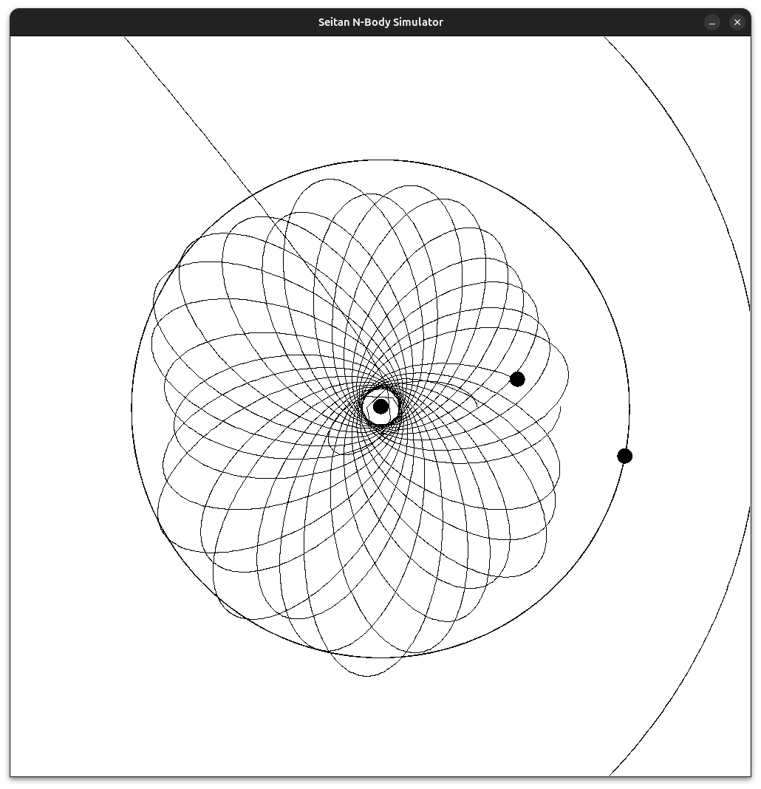

# seitanbodysimulator
An N-body simulator written in Python.

## Installation
You first need to clone the repo:

```bash
git clone https://github.com/letlovewin/seitanbodysimulator.git
```

then install dependencies:

```bash
sudo apt install python3-sympy && apt install python3-tkinter && apt install python3-ttkthemes
```

and now run it:

```bash
./run.sh
```

You may be notified by your OS that the file doesn't have permissions to run. If so:

```bash
sudo chmod +x run.sh
```

## Examples
Given the system

```python
delta_t = 86400
a = 0
b = 86400 * 10 * 365

universe = gravity.Universe(radius=2.50e+11)

earth = gravity.Particle(universe,root_canvas,[1.4960e+11,0.0000e+00],[0.0000e+00,2.9800e+04],5.9740e+24,"Earth")
mars = gravity.Particle(universe,root_canvas,[2.2790e+11,0.0000e+00],[0.0000e+00, 2.8100e+04],6.4190e+23,"Mars")
mercury = gravity.Particle(universe,root_canvas,[5.7900e+10, 0.0000e+00],[0.0000e+00, 1.7900e+04],3.3020e+23,"Mercury")
sun = gravity.Particle(universe,root_canvas,[0.0000e+00,0.0000e+00],[0.0000e+00, 0.0000e+00],1.9890e+30,"Sun")
venus = gravity.Particle(universe,root_canvas,[1.0820e+11, 0.0000e+00],[0.0000e+00, -1.5000e+04],4.8690e+24,"Venus")
```

you'll get a result of

```
Earth
Position:  [146875564755.28265, -29735936796.832027]
Velocity:  [5909.586126681024, 29156.521435676383]
Mass:  5.974e+24
Mars
Position:  [-253020336262.69968, -311024800430.8225]
Velocity:  [15938.637397552742, -5716.303419113269]
Mass:  6.419e+23
Mercury
Position:  [-7623746753050.549, 9174651726418.373]
Velocity:  [-23836.031348320346, 28549.072576870418]
Mass:  3.302e+23
Sun
Position:  [813279.940325275, 19070137.642651234]
Velocity:  [-0.09747144302396016, 0.006743457628361959]
Mass:  1.989e+30
Venus
Position:  [82136718875.62457, 16542223847.993666]
Velocity:  [31798.02335731332, -13363.769482234246]
Mass:  4.869e+24
```

and the paths would look like
